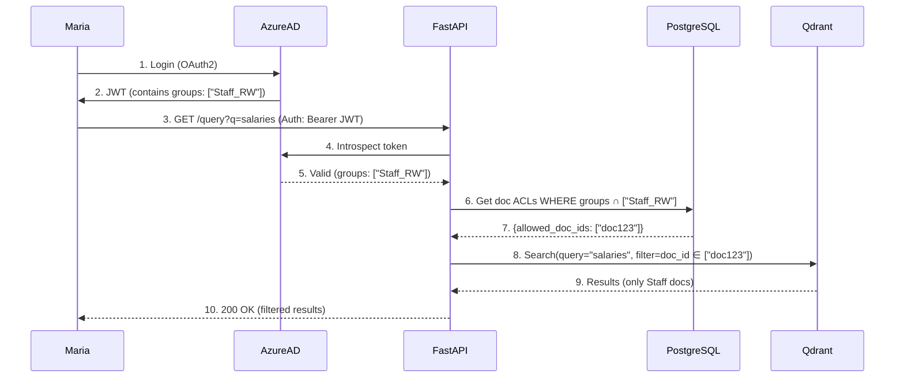

## Homelab Retrieval-Augmented Generation (RAG)  

A Retrieval-Augmented Generation (RAG) system designed to ingest, embed, and query ~200,000 Artificial Intelligence research papers.

### Project Goals
1.	Hands-on learning - Build my first non-trivial Linux software project, gaining practical experience with Python, Bash, GitHub, monitoring, and related tooling.
2.	Deep dive into RAG & AI - Explore the architecture, components, and best practices of retrieval-augmented generation systems.
3.	Practical research assistant - Maintain a weekly-updated repository of the latest AI research, enriched through my RAG pipeline and queried via LLMs.

The lab ingests ~200,000 AI research papers from **SharePoint**, **OpenAlex**, and other sources. It extracts metadata and ACLs, and generates vector embeddings for retrieval-augmented LLM reasoning. Each week I will add the latest available papers. 

- **Flexible LLM backends**: OpenAI’s ChatGPT, Google Gemini, or local models.  
- **Interchangeable components**: Ingestion, embedding, vector storage, retrieval orchestration, and LLM reasoning are decoupled.  
- **LangChain-based orchestration**: Dynamic context assembly & prompt engineering.  

## Current Ingestion & Embedding Status 
- PDFs in MinIO: 85987  
- JSON metadata in PostgreSQL: 85987  
- Distinct chunked papers: 63004  
- Papers with ANY chunk embedded: 8467  
- Fully embedded papers (ALL chunks): 8466  
- Any-embed progress: 8467/63004 (13.44%) — Remaining (any): 54537  
- Full-embed progress: 8466/63004 (13.44%) — Remaining (full): 54538  
18 August 2025 12:36:13

## Project Structure  

Each functional stage of the pipeline has:  
- a **folder** in the repository (code & configs)  
- a **dedicated Git branch** (isolated development)  
- a **dedicated VM** (runtime environment)  

This **1:1:1 mapping** enforces clear separation of concerns and makes it easy to evolve, test, or swap out stages independently. As I move forward, this will evolve to a more standard feature-branching workflow within each service branch.  

| Repo Folder       | VM Name              | Branch Name              | Description                                                      |
|------------------|----------------------|--------------------------|------------------------------------------------------------------|
| Management       | lab-1-mgmt1          | lab-1-mgmt1              | Management & orchestration (Terraform, Ansible, backups)         |
| Database         | lab-1-db1            | lab-1-db1                | Metadata (PostgreSQL) + Vector DB (Qdrant)                       |
| EmbedGeneration  | lab-1-embed-generator| lab-1-embed-generator    | Embedding Service (currently: nomic-embed-text-v1)               |
| Ingestion        | lab-1-ingestion      | lab-1-ingestion          | Data ingestion (SharePoint + OpenAlex pipelines)                 |
| UI               | lab-1-ui             | lab-1-ui                 | UI layer (Prototyping: Streamlit; Prod: React + TypeScript)      |
| Retrieval        | lab-1-retrieval      | lab-1-retrieval          | FastAPI retrieval microservice + LangChain orchestration         |
| Storage          | lab-1-storage01      | lab-1-storage01          | Object storage (MinIO)                                           |
| Monitoring       | lab-1-monitoring     | lab-1-monitoring         | Monitoring & Logging (Prometheus, Grafana, Alertmanager, Filebeat → Elasticsearch)             |

## Retrieval Metrics
These metrics run in the evaluation pipeline (Metrics & Golden Set stage) to measure how well the retriever (Qdrant + re-ranking) surfaces relevant documents, independent of the LLM.

As I experiment with RAG pipelines, the challenge is tracing how changes to each stage affect overall performance. Metrics like these provide a starting point for systematically measuring and comparing those impacts.

**Precision@k** - Fraction of retrieved documents that are relevant:

$$
Precision@k = \frac{1}{N}\sum_{i=1}^{N} \frac{|G_i \cap R_{i,k}|}{k}
$$

**Recall@k** - Percentage of queries where at least one relevant document appears in top-k results:

$$
Recall@k = \frac{1}{N}\sum_{i=1}^{N} \mathbb{1}[G_i \cap R_{i,k} \neq \emptyset]
$$

**Mean Reciprocal Rank (MRR@k)** - Average of reciprocal ranks of first relevant result:

$$
MRR@k = \frac{1}{N}\sum_{i=1}^{N} \frac{1}{rank_i}
$$

Where:
- $G_i$ = Set of ground truth relevant IDs for query $i$
- $R_{i,k}$ = Top-k retrieved IDs for query $i$
- $\mathbb{1}[\cdot]$ = Indicator function (1 if true, 0 otherwise)
- $rank_i$ = Position of first relevant result (∞ if none found)
- $|\cdot|$ = Cardinality of set

## Infrastructure  

Hosted on a Minisforum UM890 Pro running Proxmox  
- Ryzen 9 8945HS  
- 64 GB DDR5 RAM  
- 2 TB NVMe

## RAG CLI — Knowledge Repository Manager

I'm working on centralising the utilities I've build into a CLI. As well as some basic management tasks, this will enable users to add standalone documents to the system, experiment with download JSON filters and explore the repository.  

- `rag testfilter` — Preview OpenAlex filter results (count, sample titles). 
- `rag count` — Show total results for the current filter.  
- `rag fetch` — Fetch metadata pages to `/metadata/pages` (no PDFs).  
- `rag download` — Download per-work metadata and PDFs into `/metadata` and `/pdf`.  
- `rag add <pdf>` — Add a standalone PDF; enrich metadata via DOI/AI; validate and save.  
- `rag validate` — Validate all JSON/PDF pairs; quarantine failures.  
- `rag ingest` — Upsert validated works into Postgres.  
- `rag dedupe` — Merge duplicates using IDs and heuristics.  
- `rag status` — Show repository health (counts, quarantined files, last run info).

## Project Timeline (2025–2027)

| Dates           | Project                          | Notes                                                                 |
|-----------------|----------------------------------|-----------------------------------------------------------------------|
| Jun – Aug 2025  | Core RAG Build (hybrid: on-prem + cloud LLM) | Self-hosted ingestion, storage, retrieval; query LLM (ChatGPT) in cloud; ~200k docs |
| Sept – Dec 2025 | SharePoint Security Integration (hybrid)      | End-to-end permission flow; SharePoint in cloud, RAG infra on-prem; fast propagation of ACL changes |
| Sept – Dec 2025 | Kubernetes/Terraform/Ansible (on-prem) | Refactor deployment of existing pipeline services into containerized + IaC form |
| Jan – Apr 2026  | Metrics & Golden Set (on-prem)   | Optimise dashboards, observability stack, golden dataset evaluation; Grafana/Prometheus self-hosted |
| May – Aug 2026  | Domain LLM (hybrid)              | Fine-tune pipeline on AI/ML research corpora (local GPUs + cloud training options); LoRA/adapters; prompt workflows |
| Sept – Dec 2026 | Graph Retriever & Re-ranking (hybrid) | Multi-hop, relationship-aware retrieval with Mistral-7B (cloud); pipeline infra on-prem |
| Jan – Jun 2027  | Cloud Migration (hybrid → cloud-native) | Migrate pipeline to AWS/GCP; hybrid homelab ↔ cloud; ensure metric parity during transition |
| Jul – Dec 2027  | Cloud Land & Expand (cloud-native) | Fully cloud-based scaling, managed services, cost optimisation, cloud-first workloads |

## SharePoint Online Security Integration
This is a challenging phase. Ideally I hope to update Qdrant/PostgreSQL permissions within 5s of SharePoint changes. One possible mechanism is event-driven sync via Graph change notifications (Graph → Event Grid → Lambda → RAG System).

I need to implement end-to-end permission flow with:
- RBAC Integration: Map Azure AD groups to Qdrant/PostgreSQL document-level access controls. Use OpenPolicyAgent or custom logic to enforce read/no-access per user/group.
- MinIO Hardening:
  - TLS via certbot for all MinIO endpoints (internal + external).
  - Bucket policies scoped to RBAC roles (e.g., s3:GetObject only for users with SharePoint read ACLs).
  - Server-side encryption (SSE-S3) for stored PDFs.

Here’s my current thinking about this implementation (subject to change).

Auth: Maria logs in, and her Azure AD groups (e.g., Staff_RW) are embedded in a signed JWT.

Enforcement: The RAG system checks these groups against document ACLs in PostgreSQL, then filters Qdrant results to only documents she’s allowed to see.

Guarantee: Even if "salaries" matches restricted Management docs, the system excludes them—security is enforced at every layer (API, DB, and vector search).

This ensures Maria never leaks unauthorised data, while maintaining low-latency retrieval.

### Future Exploratory Areas

- **Data Lineage Tracking**: OpenLineage for permission/change audits  
- **Federated Learning**: Train models across homelab + cloud without raw data transfer  
- **Homomorphic Encryption**: Secure processing of sensitive documents  
- **RAGAS / LangSmith**: Benchmark retrieval quality beyond golden sets  
- **Drift Detection**: Monitor embedding/model decay in production  

