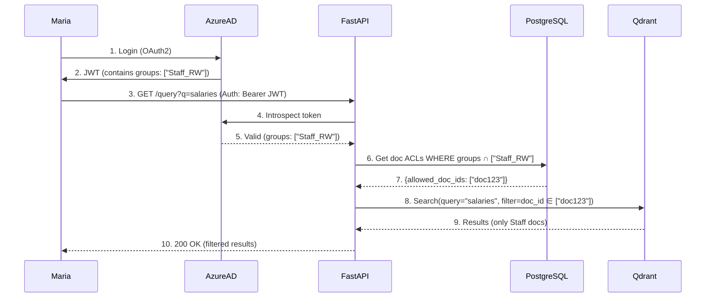

## Homelab Retrieval-Augmented Generation (RAG)  

A Retrieval-Augmented Generation (RAG) system designed to ingest, embed, and query ~200,000 Artificial Intelligence research papers.

## Project Goals
1.	Hands-on learning: Build my first non-trivial Linux software project, gaining practical experience with Python, Bash, GitHub, monitoring, and related tooling.
2.	Deep dive into RAG & AI: Explore the architecture, components, and best practices of retrieval-augmented generation systems.
3.	User Experience & Prompt Engineering: Design intuitive interfaces and effective, measurable prompts. 
4.	Practical research assistant: Maintain a weekly-updated repository of the latest AI research, enriched through my RAG pipeline and queried via LLMs.

The lab ingests ~200,000 AI research papers from **SharePoint**, **OpenAlex**, and other sources. It extracts metadata and ACLs, and generates vector embeddings for retrieval-augmented LLM reasoning. Each week I will add the latest available papers. 

## Current Ingestion & Embedding Status 
- PDFs in MinIO: 105688  
- JSON metadata in PostgreSQL: 105688  
- Distinct chunked papers: 105688  
- Papers with ANY chunk embedded: 17524  
- Fully embedded papers (ALL chunks): 17523  
- Any-embed progress: 17524/105688 (16.58%) — Remaining (any): 88164
- Full-embed progress: 17523/105688 (16.58%) — Remaining (full): 88165   
  21 August 2025 03:28:41

## Project Structure  

Each functional stage of the pipeline has:  
- a **folder** in the repository (code & configs)  
- a **dedicated Git branch** (isolated development)  
- a **dedicated VM** (runtime environment)  

This **1:1:1 mapping** enforces clear separation of concerns and makes it easy to evolve, test, or swap out stages independently. As I move forward, this will evolve to a more standard feature-branching workflow within each service branch.  

| Repo Folder       | VM Name              | Branch Name              | Description                                                      |
|------------------|----------------------|--------------------------|------------------------------------------------------------------|
| Management       | lab-1-mgmt1          | lab-1-mgmt1              | Management & orchestration (Terraform, Ansible, backups)         |
| Database         | lab-1-db1            | lab-1-db1                | Metadata (PostgreSQL) + Vector DB (Qdrant)                       |
| EmbedGeneration  | lab-1-embed-generator| lab-1-embed-generator    | Embedding Service (currently: nomic-embed-text-v1)               |
| Ingestion        | lab-1-ingestion      | lab-1-ingestion          | Data ingestion (SharePoint + OpenAlex pipelines)                 |
| UI               | lab-1-ui             | lab-1-ui                 | UI layer (Prototyping: Streamlit; Prod: React + TypeScript)      |
| Retrieval        | lab-1-retrieval      | lab-1-retrieval          | FastAPI retrieval microservice + LangChain orchestration         |
| Storage          | lab-1-storage01      | lab-1-storage01          | Object storage (MinIO)                                           |
| Monitoring       | lab-1-monitoring     | lab-1-monitoring         | Monitoring & Logging (Prometheus, Grafana, Alertmanager, Filebeat → Elasticsearch)             |

## Project Timeline (2025–2027)

| Dates           | Project                          | Notes                                                                 |
|-----------------|----------------------------------|-----------------------------------------------------------------------|
| Jun – Aug 2025  | Core RAG Build (hybrid: on-prem + cloud LLM) | Self-hosted ingestion, storage, retrieval; query LLM (ChatGPT) in cloud; ~200k docs; basic CLI |
| Sept – Oct 2025 | Prompt Engineering & User Experience | Design intuitive interfaces, prototype user flows, and build first prompt libraries |
| Nov 2025 – Jan 2026 | SharePoint Security Integration (hybrid) | End-to-end permission flow; SharePoint in cloud, RAG infra on-prem; fast propagation of ACL changes |
| Feb – Apr 2026  | Kubernetes/Terraform/Ansible (on-prem) | Refactor deployment of existing pipeline services into containerized + IaC form |
| May – Jul 2026  | Metrics & Golden Set (on-prem)   | Optimise dashboards, observability stack, golden dataset evaluation; Grafana/Prometheus; Build evaluation pipeline with retrieval quality metrics (Precision@k, Recall@k, MRR@k, etc) |
| Aug – Oct 2026  | Domain LLM (hybrid)              | Fine-tune pipeline on AI/ML research corpora (local GPUs + cloud training options); LoRA/adapters; prompt workflows |
| Nov 2026 – Jan 2027 | Graph Retriever & Re-ranking (hybrid) | Multi-hop, relationship-aware retrieval with Mistral-7B (cloud); pipeline infra on-prem |
| Feb – Jun 2027  | Cloud Migration (hybrid → cloud-native) | Migrate pipeline to AWS/GCP; hybrid homelab ↔ cloud; ensure metric parity during transition |
| Jul – Dec 2027  | Cloud Land & Expand (cloud-native) | Fully cloud-based scaling, managed services, cost optimisation, cloud-first workloads |

## SharePoint Online Security Integration (Nov 2025 – Jan 2026)
This is a challenging phase. Ideally I hope to update Qdrant/PostgreSQL permissions within 5s of SharePoint changes. One possible mechanism is event-driven sync via Graph change notifications (Graph → Event Grid → Lambda → RAG System).

I need to implement end-to-end permission flow with:
- RBAC Integration: Map Azure AD groups to Qdrant/PostgreSQL document-level access controls. Use OpenPolicyAgent or custom logic to enforce read/no-access per user/group.
- MinIO Hardening:
  - TLS via certbot for all MinIO endpoints (internal + external).
  - Bucket policies scoped to RBAC roles (e.g., s3:GetObject only for users with SharePoint read ACLs).
  - Server-side encryption (SSE-S3) for stored PDFs.

Here’s my current thinking about this implementation from a user perspective (assuming I've already figured out the permissions sync challenge).

Auth: Maria logs in, and her Azure AD groups (e.g., Staff_RW) are embedded in a signed JWT.

Enforcement: The RAG system checks these groups against document ACLs in PostgreSQL, then filters Qdrant results to only documents she’s allowed to see.

Guarantee: Even if "salaries" matches restricted Management docs, the system excludes them—security is enforced at every layer (API, DB, and vector search).

This ensures Maria never accesses unauthorised data, while maintaining low-latency retrieval. A key part of this work will be automated testing to ensure the integrity of the mechanism. 

## Infrastructure  

Hosted on a Minisforum UM890 Pro running Proxmox  
- Ryzen 9 8945HS  
- 64 GB DDR5 RAM  
- 2 TB NVMe
  
[Click here to read about my ongoing efforts to manage CPU & RAM allocation](https://github.com/lanternadev/rag-lab/blob/main/Management/deploy/vmsetup.md)

## Performance & Tuning
Now that I have a functional pipeline, I'm learning how to measure and tune performance. Going forward I'll add more hardware, however the metrics I establish now will always be relevant. 

At present I’m running entirely on CPU (Ryzen 9 8945HS), with no GPU acceleration. While that imposes obvious limits, it also creates a great opportunity to learn how to push systems through careful configuration, query optimisation, and monitoring rather than raw compute power. (In other words, and in less spinny terms, my hardware is underspecced but I'm making the most of it by learning about tuning.)

One of the main areas I’m exploring is PostgreSQL performance. These are some of the metrics I'm tracking:

# PostgreSQL Health Check Summary

| Check                        | Command (psql)                                                                                                                                          | Healthy Target                  |
|-------------------------------|----------------------------------------------------------------------------------------------------------------------------------------------------------|---------------------------------|
| Global cache hit ratio        | SELECT round(sum(blks_hit)*100/nullif(sum(blks_hit)+sum(blks_read),0),2) FROM pg_stat_database;                                                         | > 95%                           |
| Per-database cache ratio      | SELECT datname, round(blks_hit*100.0/nullif(blks_hit+blks_read,0),2) FROM pg_stat_database ORDER BY blks_read DESC;                                      | > 95% for main DB               |
| Table-level IO hot spots      | SELECT relname, heap_blks_read, heap_blks_hit, round(heap_blks_hit*100.0/nullif(heap_blks_read+heap_blks_hit,0),2) AS hit_pct FROM pg_statio_user_tables ORDER BY heap_blks_read DESC LIMIT 15; | hit_pct > 95%, low reads        |
| Index-level IO hot spots      | SELECT relname, indexrelname, idx_blks_read, idx_blks_hit, round(idx_blks_hit*100.0/nullif(idx_blks_hit+idx_blks_read,0),2) AS hit_pct FROM pg_statio_user_indexes ORDER BY idx_blks_read DESC LIMIT 15; | hit_pct > 95%, low reads        |
| Slowest queries               | SELECT query, calls, round(mean_exec_time,2) ms FROM pg_stat_statements ORDER BY mean_exec_time DESC LIMIT 10;                                           | mean_exec_time < 50ms (OLTP)    |
| Chunk fetch query efficiency  | EXPLAIN (ANALYZE, BUFFERS) SELECT id, work_id, text FROM chunks WHERE embedded = FALSE ORDER BY created_at LIMIT 1000;                                   | Execution time < 50ms, mostly hits |

[Bash script here](https://github.com/lanternadev/rag-lab/blob/main/Monitoring/postgres_metrics.sh)

## RAG CLI — Knowledge Repository Manager

I'm working on centralising the utilities I've build into a CLI. As well as some basic management tasks, this will enable users to add standalone documents to the system, experiment with download JSON filters and explore the repository.  

- `rag testfilter` — Preview OpenAlex filter results (count, sample titles). 
- `rag count` — Show total results for the current filter.  
- `rag fetch` — Fetch metadata pages to `/metadata/pages` (no PDFs).  
- `rag download` — Download per-work metadata and PDFs into `/metadata` and `/pdf`.  
- `rag add <pdf>` — Add a standalone PDF; enrich metadata via DOI/AI; validate and save.  
- `rag validate` — Validate all JSON/PDF pairs; quarantine failures.  
- `rag ingest` — Upsert validated works into Postgres.  
- `rag dedupe` — Merge duplicates using IDs and heuristics.  
- `rag status` — Show repository health (counts, quarantined files, last run info).

## Future Exploratory Areas

- **Data Lineage Tracking**: OpenLineage for permission/change audits  
- **Federated Learning**: Train models across homelab + cloud without raw data transfer  
- **Homomorphic Encryption**: Secure processing of sensitive documents  
- **RAGAS / LangSmith**: Benchmark retrieval quality beyond golden sets  
- **Drift Detection**: Monitor embedding/model decay in production  
